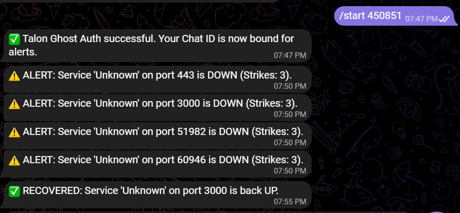

# Talon Handler


Talon Handler is a high-performance, purely algorithmic Python CLI tool designed for Homelab monitoring. It automates service discovery, monitors your local ports, and integrates with Telegram via a secure Ghost Auth bridge.

## Key Features
- Smart Scan: Automatically detects locally bound ports using psutil and maps them to the actual process names (nginx, sshd, docker-proxy, etc.).
- Ghost Auth: Cryptographically secure 6-digit OTP authentication for Telegram without hardcoded chat IDs.
- Monitoring Filter: Interactively toggle which services you want to track.
- Live Dashboard: Automatically generates a Markdown dashboard (talon_dashboard.md) for Homarr or other notebook widgets.
- 3-Strike Alerts: Algorithmic failure detection to prevent notification spam.
- Background Execution: Run the monitor as a detached process with easy stop/start commands.

## Installation

### Standard Installation
The easiest way to install Talon Handler is directly via pip:
```bash
pip install talon-handler
```
*Note: On modern Ubuntu systems, you may need to use `pip install talon-handler --break-system-packages` or install via `pipx`.*

### Development Installation
If you wish to contribute or modify the source code:
```bash
git clone https://github.com/abduznik/talon-handler.git
cd talon-handler
pip install -e .
```

## Quick Start: The Headstart Command

The headstart command is your entry point. It initializes your configuration and performs the first service discovery scan.

### 1. Run Headstart
```bash
talon headstart
```

### 2. Discovered Services
Talon will scan your system and display a table of discovered services:
```
+-------+----------------------------+
| Port  | Detected Process / Service |
+-------+----------------------------+
| 80    | nginx                      |
| 22    | sshd                       |
| 8096  | docker-proxy (Jellyfin)    |
+-------+----------------------------+
```

### 3. Ghost Auth
After scanning, Talon will generate a unique code:
**Ghost Auth Code generated: 123456**

Send this code to your Telegram bot to bind your account:
`/start 123456`



## Commands

### Authentication Code
Generate a fresh Ghost Auth code at any time:
```bash
talon code
```

### Service Filtering
Toggle monitoring for specific ports discovered during scans:
```bash
talon filter
```

### Background Monitoring
Start the watcher in the background:
```bash
talon monitor --detach
```

Stop the background watcher:
```bash
talon stop
```

### Configuration Audit
Update your Telegram token or monitoring interval interactively:
```bash
talon config
```

## Dashboard Output
The tool periodically writes to `talon_dashboard.md`, which can be displayed in Homarr:
```markdown
# Talon Handler Dashboard
Last Updated: 2026-02-21 18:00:00

## Service Status
| Service | Port | Status |
| :--- | :--- | :--- |
| nginx | 80 | UP |
| docker-proxy (Jellyfin) | 8096 | UP |
```

## Requirements
- Python 3.10+
- psutil
- python-telegram-bot
- typer
- rich

---
Created by abduznik
